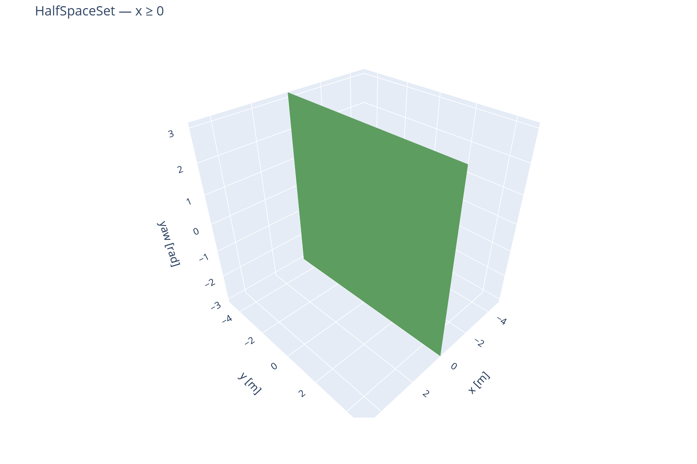
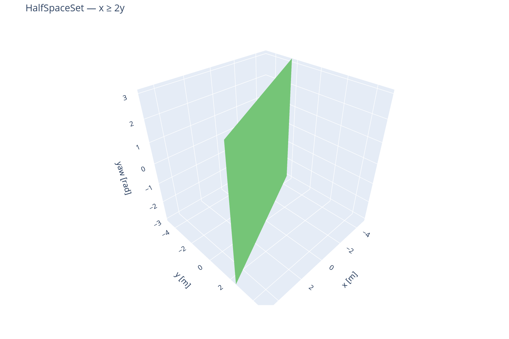
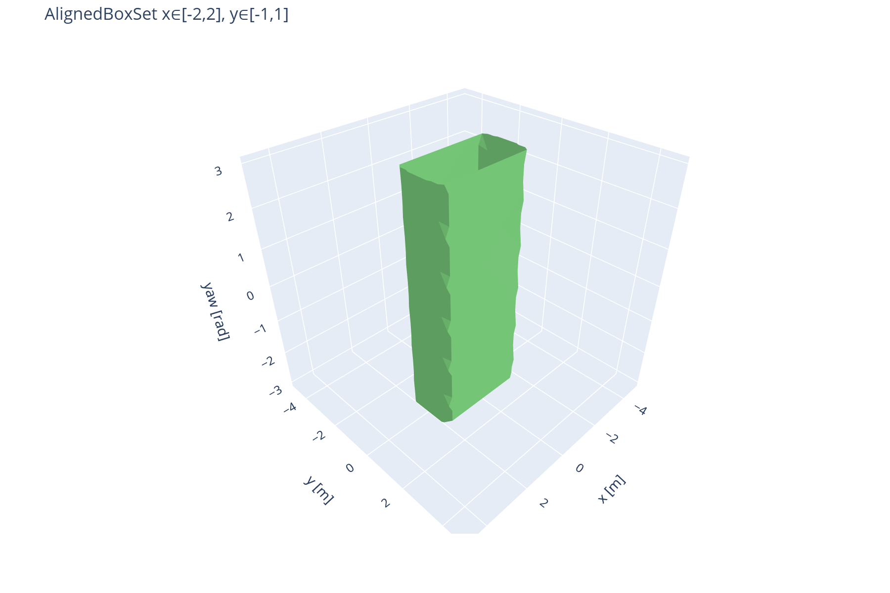
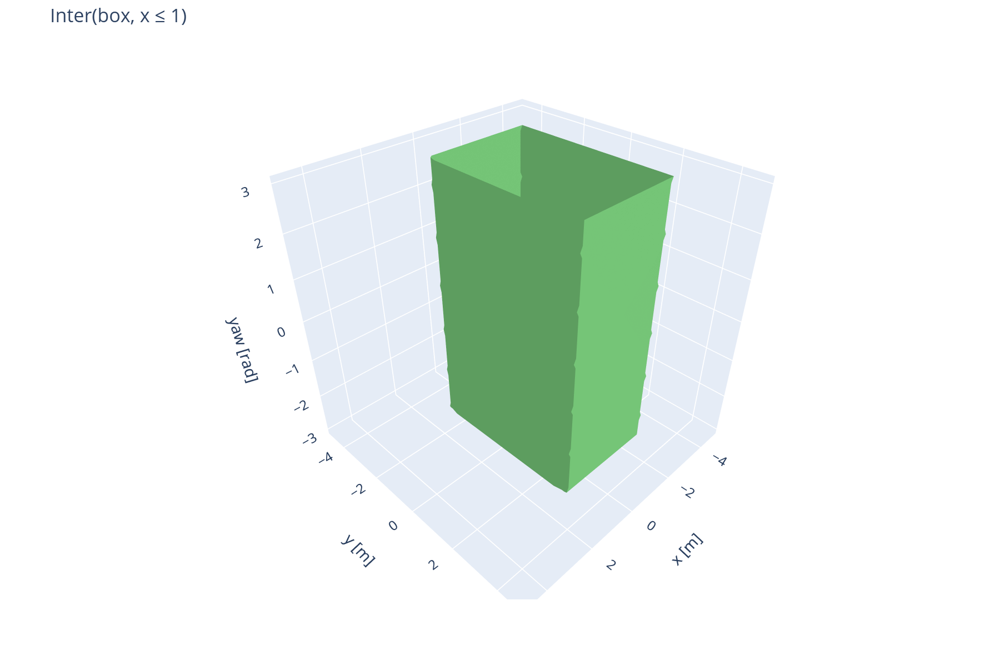
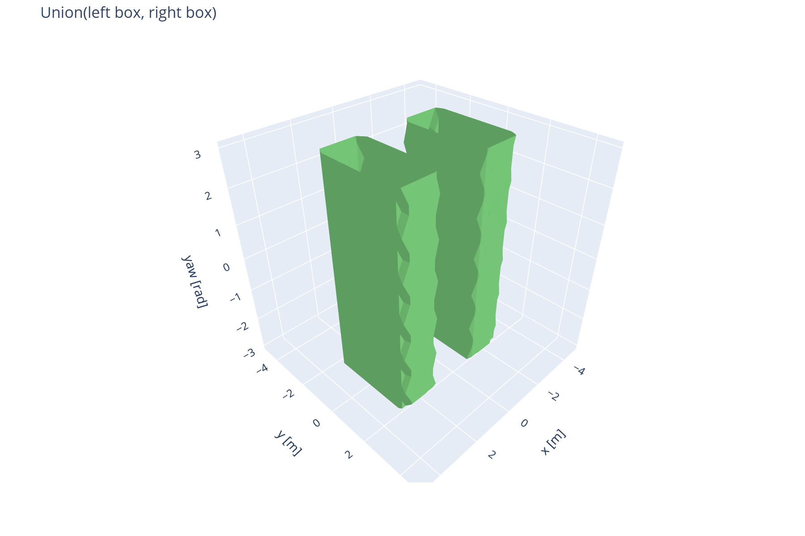
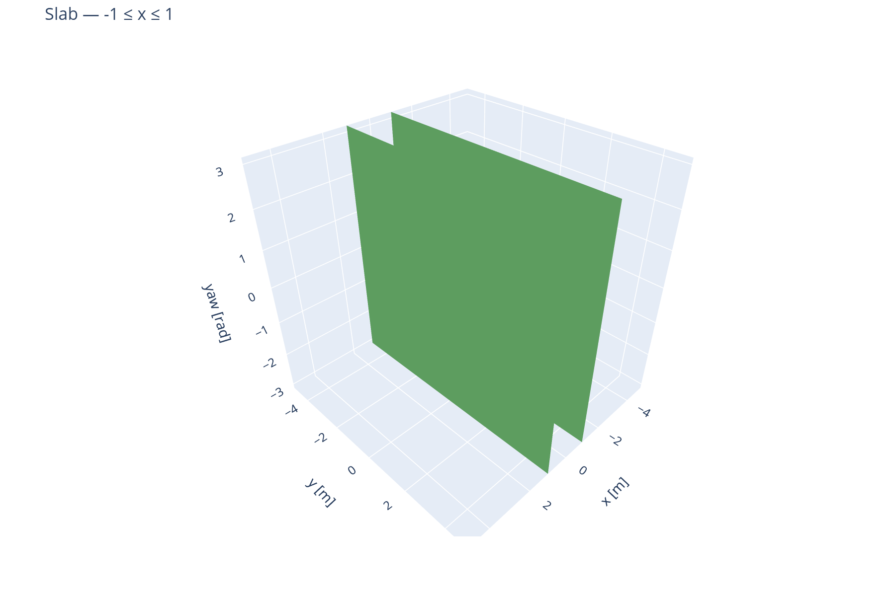
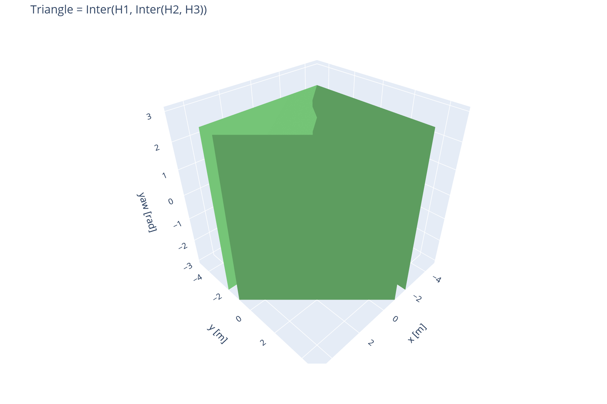

# Set Builders

This tutorial shows how to describe **simple geometric shapes** with pyspect
SetBuilders, realize them on a backend, and visualize the result. No temporal
logic, no reachability queries.

For API details on each class, see [Set Builders (reference)](../reference/set_builder.md).

## What is a SetBuilder?

A **SetBuilder** describes a set *without* choosing a representation upfront.
You pick a backend (`Impl`) and **realize** the description on a grid.

Every example in this tutorial follows the same **three steps**:

1. **Describe** — pick a SetBuilder (`HalfSpaceSet`, `AlignedBoxSet`, …)
2. **Realize** — call `Out = S(impl)` to get a concrete level-set array
3. **Visualize** — call `impl.plot(...).show()` (interactive Plotly figure)

```python
S   = AlignedBoxSet(x=(-2, 2), y=(-2, 2))   # 1. describe
Out = S(impl)                                 # 2. realize
impl.plot(fix_t(Out), method='isosurface', axes=('x', 'y', 'yaw')).show()  # 3. visualize
```

The static images below each example are **screenshots of step 3**. In your own
session, run the full code block to get an interactive 3D view. See
[`examples/set_builders_doc_figures.ipynb`](../../examples/set_builders_doc_figures.ipynb).

---

## Setup

`TVHJImpl` requires a **time axis first**, then spatial axes, and a dynamics
class matching the spatial dimensions. We use **Air3d** `(t, x, y, yaw)`.

When a SetBuilder only constrains `x` and `y`, the shape is independent of
`yaw` (that axis becomes a singleton in the result). The 3D plots still use
`(x, y, yaw)` — the shape looks like an extrusion along `yaw`.

You need `pip install pyspect[hj_reachability]`.

```python
from math import pi

import numpy as np
from pyspect import Inter, Union
from pyspect.set_builder import AlignedBoxSet, HalfSpaceSet
from pyspect.impls.hj_reachability import TVHJImpl
from pyspect.systems.hj_reachability import Air3d

AXES = [
    dict(name='t', bounds=[0, 1], step=1.0, unit='s'),
    dict(name='x', bounds=[-5, +5], points=25, unit='m'),
    dict(name='y', bounds=[-5, +5], points=25, unit='m'),
    dict(name='yaw', bounds=[-pi, +pi], points=12, unit='rad'),
]

impl = TVHJImpl(dict(cls=Air3d), AXES)


def fix_t(vf, t=0):
    """Pick one time slice and broadcast to the full grid shape (needed for plot)."""
    vf4d = np.array(vf[t : t + 1, ...])
    return np.broadcast_to(vf4d, (1,) + tuple(impl.shape[1:])).copy()
```

All examples below assume `impl` and `fix_t` are defined.

---

## 1. HalfSpaceSet — one half-plane

A **half-space** is the set on one side of a hyperplane. The set lies in the
**direction of the normal**. You specify:

- **`normal`**: coefficients along each listed axis (points *into* the set)
- **`offset`**: a point on the boundary plane
- **`axes`**: which coordinates the constraint applies to

**Example:** points with `x ≥ 0` (vertical wall at `x = 0`)

```python
H = HalfSpaceSet(normal=[1, 0], offset=[0, 0], axes=['x', 'y'])
Out = H(impl)
impl.plot(fix_t(Out), method='isosurface', axes=('x', 'y', 'yaw')).show()
```

*Figure — step 3 (`impl.plot`):*



**Example:** oblique constraint `x ≥ 2y`

```python
H = HalfSpaceSet(normal=[1, -2], offset=[0, 0], axes=['x', 'y'])
Out = H(impl)
impl.plot(fix_t(Out), method='isosurface', axes=('x', 'y', 'yaw')).show()
```

*Figure — step 3:*



!!! tip "When to use"
    One linear inequality — walls, half-planes, staying in front of an obstacle.

---

## 2. AlignedBoxSet — axis-aligned box

The most common shape: a **rectangle / box** aligned with the grid axes.

```python
BOX = AlignedBoxSet(x=(-2, 2), y=(-1, 1))
Out = BOX(impl)
impl.plot(fix_t(Out), method='isosurface', axes=('x', 'y', 'yaw')).show()
```

*Figure — step 3:*



Under the hood, `AlignedBoxSet` builds an intersection of half-spaces (one lower
and one upper bound per axis). It also supports open bounds and periodic axes;
see the [API reference](../reference/set_builder.md).

!!! tip "When to use"
    Corridors, regions of interest, bounding boxes — whenever bounds are
    axis-aligned.

---

## 3. Combining shapes — `Inter`, `Union`, `Compl`

| Operation | Meaning | Syntax |
|-----------|---------|--------|
| Intersection | inside **all** sets | `Inter(A, B)` |
| Union | inside **any** set | `Union(A, B)` |
| Complement | outside a set | `Compl(A)` |

`Inter` and `Union` take **two** builders at a time on `TVHJImpl` — nest calls
for three or more (same as in [section 5](#5-convex-polygon-intersection-of-half-spaces)).
The complement operator is named **`Compl`** in the API (not `Complement`).

**Example:** trim a box with a half-space (`x ≤ 1`)

```python
base = AlignedBoxSet(x=(-3, 3), y=(-3, 3))
cut  = HalfSpaceSet(normal=[-1, 0], offset=[1, 0], axes=['x', 'y'])  # x <= 1
Out  = Inter(base, cut)(impl)
impl.plot(fix_t(Out), method='isosurface', axes=('x', 'y', 'yaw')).show()
```

*Figure — step 3:*



**Example:** union of two boxes

```python
left  = AlignedBoxSet(x=(-3, -1), y=(-2, 2))
right = AlignedBoxSet(x=(1, 3), y=(-2, 2))
Out   = Union(left, right)(impl)
impl.plot(fix_t(Out), method='isosurface', axes=('x', 'y', 'yaw')).show()
```

*Figure — step 3:*



---

## 4. Slab — band between two parallel planes

A **slab** (infinite strip) is the intersection of two opposing half-spaces.
Example: `-1 ≤ x ≤ 1`

```python
SLAB = Inter(
    HalfSpaceSet(normal=[ 1, 0], offset=[-1, 0], axes=['x', 'y']),  # x >= -1
    HalfSpaceSet(normal=[-1, 0], offset=[ 1, 0], axes=['x', 'y']),  # x <=  1
)
Out = SLAB(impl)
impl.plot(fix_t(Out), method='isosurface', axes=('x', 'y', 'yaw')).show()
```

*Figure — step 3:*



!!! tip "When to use"
    Corridors with fixed width along one direction.

---

## 5. Convex polygon — intersection of half-spaces

Any **convex polygon** is an intersection of finitely many half-spaces (one per
edge). `Inter` takes **two** sets at a time, so nest calls for three or more
constraints.

Example: triangle

```python
H1 = HalfSpaceSet(normal=[ 1,  0], offset=[-2,  0], axes=['x', 'y'])
H2 = HalfSpaceSet(normal=[ 0,  1], offset=[ 0, -2], axes=['x', 'y'])
H3 = HalfSpaceSet(normal=[-1, -1], offset=[ 2,  2], axes=['x', 'y'])

TRI = Inter(H1, Inter(H2, H3))
Out = TRI(impl)
impl.plot(fix_t(Out), method='isosurface', axes=('x', 'y', 'yaw')).show()
```

*Figure — step 3:*



For many edges, nest `Inter(...)` calls or use
[`PolytopeSet`](../reference/set_builder.md) once your backend implements it.

---

## 6. Other plot options

The examples above use a **3D isosurface** because the grid includes `yaw`.
For a flat **2D slice** in the `(x, y)` plane only:

```python
impl.plot(fix_t(Out), method='bitmap', axes=('x', 'y')).show()
```

---

## Which builder should I use?

| Goal | Use |
|------|-----|
| Single linear constraint | `HalfSpaceSet` |
| Axis-aligned box / rectangle | `AlignedBoxSet` |
| Band / corridor (two parallel walls) | `Inter` of two `HalfSpaceSet` |
| Convex polygon / polyhedron | `Inter` of many `HalfSpaceSet` |
| Combine regions | `Inter`, `Union`, `Compl` |

**Not supported on `TVHJImpl` today:** `BallSet`, `CylinderSet`. Until
[`PolytopeSet`](../reference/set_builder.md) is wired up on your backend, build
polyhedra with nested `Inter` of `HalfSpaceSet` as above.

---

## Next steps

- [Set Builders reference](../reference/set_builder.md) — full API, parameters, `Requires`
- [Get Started](../get_started.md) — temporal logic and full specs
- [`examples/set_builders_doc_figures.ipynb`](../../examples/set_builders_doc_figures.ipynb) — run the same examples interactively
